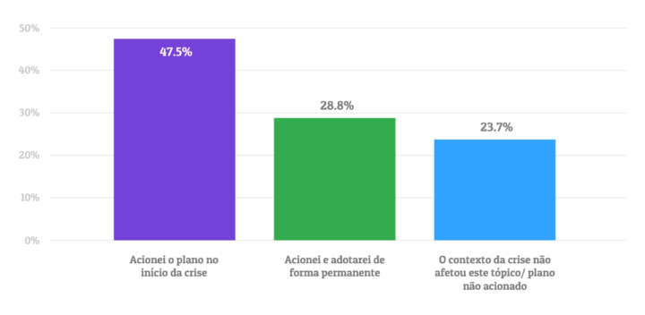
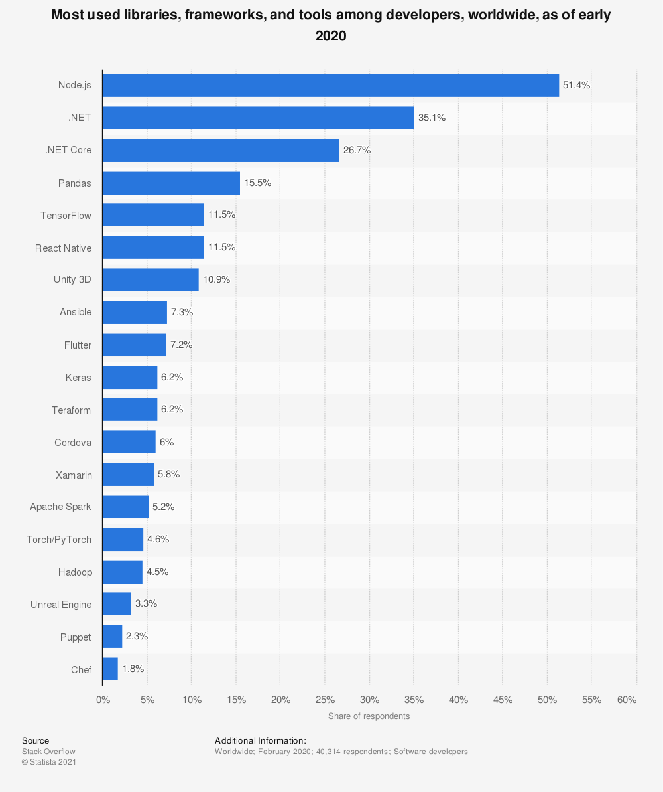
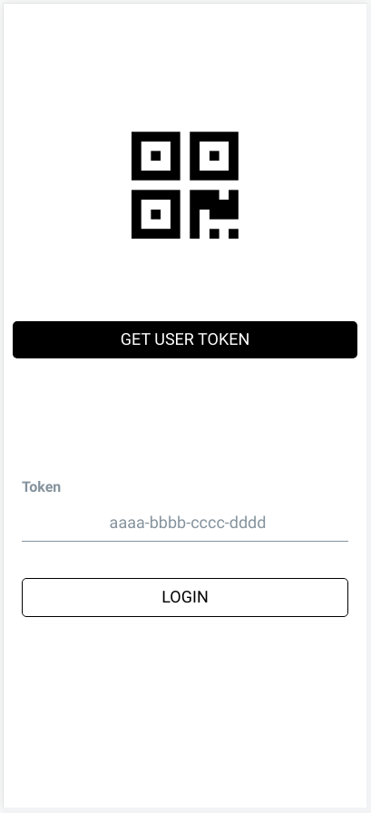
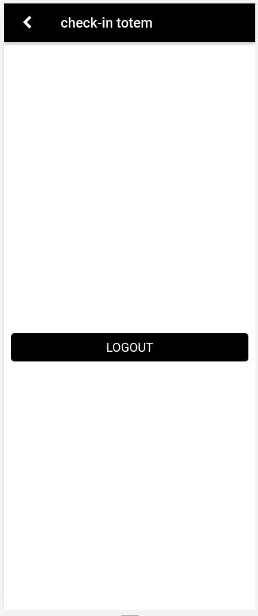

# Resumo:

Com novos modelos de trabalho que envolvem tanto a jornada no escritório como a distância surgindo fica cada vez mais difícil para gerentes de organizações acompanharem o comparecimento de seus colaboradores. Uma das empresas que adotou o modelo híbrido, e todos os desafios que este modelo trás, foi a JB3 Investimentos, um escritório de Assessoria de Investimentos de Santa Catarina. Eles buscam uma forma simples de seus colaboradores registrarem suas presenças nos escritórios físicos, para depois analisar os dados salvos, gerando relatórios para acompanhar a adoção a nova jornada de trabalhoCom novos modelos de trabalho que envolvem tanto a jornada no escritório como a distância surgindo fica cada vez mais difícil para gerentes de organizações acompanharem o comparecimento de seus colaboradores. Uma das empresas que adotou o modelo híbrido, e todos os desafios que este modelo trás, foi a JB3 Investimentos, um escritório de Assessoria de Investimentos de Santa Catarina. Eles buscam uma forma simples de seus colaboradores registrarem suas presenças nos escritórios físicos, para depois analisar os dados salvos, gerando relatórios para acompanhar a adoção da nova jornada.

# Abstract

With new work models emerging that involve both office hours and distance work, it is increasingly difficult for managers of organizations to keep up with the attendance of their employees. One of the companies that adopted the hybrid model, and all the challenges that this model brings, was JB3 Investimentos, an Investment Advisory Office in Santa Catarina. They are looking for a simple way for their employees to register their presence in physical offices, and then analyze the saved data, generating reports to keep track of the new attendence model.

# 1 Introdução:

A epidemia da covid-19 forçou nossa adaptação a várias questões da vida cotidiana. Uma significativa parcela da população brasileira precisou adequar-se às demandas do trabalho, que eram executadas majoritariamente de forma presencial, consolidando as modalidades de trabalho remoto e híbrido, exigidas pela necessidade de afastamento social.

Em se tratando do trabalho híbrido, a flexibilidade do lugar de onde e de quando se exercer as tarefas, com a possibilidade de realizá-las no próprio local de trabalho ou outro de livre escolha, tem se mostrado uma opção viável, trazendo o melhor dos dois mundos, o do trabalho convencional e o do teletrabalho. No entanto, traz consigo seus próprios desafios. Um deles é a organização de ambientes de trabalho compartilhados, dificultando saber quais estações de trabalho estão sendo ocupadas e por quem. Isso levou empresas a desenvolverem suas próprias soluções para esse controle.

Pré pandemia, horários rígidos e supervisão a todo momento era a norma para o mercado de trabalho, no entanto, forçadas a mudar, companhias vêm enxergando cada vez mais os benefícios de uma jornada de trabalho flexível.

“Estamos exercitando um olhar diferente [dentro do RH], que tem a ver com inclusão e respeito às individualidades, e conciliar o que é necessidade da empresa com as possibilidades das pessoas”

- Elisabete Rello, diretora de RH da Bayer no Brasil.



Gráfico de Adoção de plano de contingência – Trabalho remoto e horários flexíveis (Fonte: [Estudo Panorama PMEs](https://resultadosdigitais.com.br/blog/panorama-pmes-medidas-trabalho-remoto/))

É importante ressaltar que o movimento para jornadas flexiveis/remotas vem crescendo organicamente a um tempo consideravél, como foi apontado no estudo de [future trends](http://reports.weforum.org/future-of-jobs-2016/employment-trends/) conduzido pelo _World Economic Forum_:

_"...An additional dimension to consider is the general trend towards flexible work, identified by our respondents as one of the biggest drivers of transformation of business models in many industries and therefore also one of the topmost concerns at the national level in many of the Report’s focus countries. Telecommuting, co-working spaces, virtual teams, freelancing and online talent platforms are all on the rise, transcending the physical boundaries of the office or factory floor and redefining the boundary between one’s job and private life in the process. Modern forms of workers’ organization, such as digital freelancers’ unions, and updated labour market regulations are beginning to emerge to complement these new organizational models. The challenge for employers, individuals and governments alike is going to be to work out ways and means to ensure that the changing nature of work benefits everyone..."_

**Tradução Livre**:

_"...Uma dimensão adicional a ser considerada, é a tendência geral para o trabalho flexível, identificado pelos nossos entrevistados como um dos maiores motores de transformação de modelo de negócios em muitos setores e, portanto, também uma das principais preocupações a nível nacional em muitos dos Países em foco do relatório. Teletrabalho, espaços de coworking, equipes virtuais, freelance e plataformas de talentos online estão todos em ascensão, transcendendo os limites físicos do escritório e redefinindo a fronteira entre o trabalho e a vida privada no processo. Formas modernas de organização dos trabalhadores, como sindicatos de freelancers digitais, e regulamentações atualizadas do mercado de trabalho estão começando a surgir para complementar esses novos modelos organizacionais. O desafio para empregadores, indivíduos e governos será encontrar maneiras e meios de garantir que a natureza mutável do trabalho beneficie a todos..."_

Porém, nem todas empresas que estão flexibilizando seus modelos de trabalho, têm a capacidade de desenvolver um sistema de controle, ou mudar para uma suíte de comunicação interna que inclui tal sistema.

A JB3 Investimentos, o potencial cliente do sistema a ser desenvolvido neste trabalho de graduação, adotou um sistema baseado em reservas e checkins, já que com distânciamento social não consegue acomodar todos funcionários em seu escritório físico. No entanto tem encontrado dificuldades em acompanhar as reservas e presenças de seus colaboradores, necessitando de alguma forma de fácil implantação e usabilidade para gerenciar reservas e checkins de seus colaboradores.

## 1.1 Objetivos do trabalho:

O objetivo geral deste trabalho é disponibilizar um sistema de check-in para estações de trabalho, acompanhado de uma interface web para gerenciar o sistema e acessar os dados coletados.

O sistema será composto por dois aplicativos para dispositivos móveis que consumirão uma API principal:

- **Aplicativo destinado ao usuário**: O aplicativo será o meio que o funcionário usará para verificar disponibilidades, realizar reservas e gerar um código para checkin.
- **Aplicativo Totem**: O objetivo deste aplicativo, é ser implantado em dispositivos disponíveis em áreas comuns, como recepções para que os funcionários consigam entrar com seu código temporário e confirmar seu checkin.
- **API**: A API será responsável por expor rotas que serão consumidas por ambos aplicativos. Todo acesso aos dados será feito por ela, sendo necessário diferentes níveis de permissão para cada funcionalidade.
- **Interface Web**: O site será acessado apenas por usuários permitidos pela organização, com o intuito de gerenciar o sistema.

## 1.2 Conteúdo do trabalho:

O presente trabalho está estruturado em seis Capítulos, cujo conteúdo é sucintamente apresentado a seguir:

No Capítulo 2 é feita a fundamentação teórica das tecnologias utilizadas para o desenvolvimento do sistema.

O Capítulo 3 apresenta o desenvolvimento da solução.

No Capítulo 4 são apresentados os resultados.

O Capítulo 5 apresenta as considerações finais deste trabalho a partir da análise dos resultados obtidos.

# 2 Fundamentação técnica:

Neste capítulo serão abordadas as tecnologias e padrões utilizados para o desenvolvimento do sistema. Assim como justificações para decisões técnicas.

## 2.1 Requisitos do cliente:

Para solucionar o problema citado foi requisitado um sistema que possibilite:

- Funcionários realizarem seu checkin de forma autenticada e segura, registrando data, horário e local;
- Ferramentas de admnistração, para gestores acompanharem a utilização do sistema.

## 2.1 API (Application Programming Interface):

API é uma sigla em inglês, que significa "Interface de Programação de Aplicativo". É um conjunto de definições e protocolos para construir e integrar aplicações de software.

APIs surgiram no início da computação, pré-datando por muito tempo computadores pessoais. Na época, eram tipicamente utilizadas como bibliotecas para sistemas operacionais, quase sempre transmitindo mensagens localmente no mesmo sistema em que estava operando. Aproximadamente 30 anos depois, APIs remotas começaram a se tornar uma importante parte de sistemas de integração de dados.

APIs possibilitam a comunicação entre serviços e produtos, sem necessitar que conheçam mutuamente a implementação um do outro. Isso simplifica o processo de desenvolvimento, economizando tempo e dinheiro.

Uma forma de exemplificar APIs é tratá-las como contratos, com a documentação agindo como acordos entre as aplicações, detalhando o que é esperado que o consumidor forneça em suas requisições e como a resposta será estruturada.

### 2.1.1 REST (Representational State Transfer):

Há muitos protocolos projetados para padronizar APIs, um dos mais conhecidos, e que será utilizado no desenvolvimento deste trabalho, é o padrão REST, que significa "Transferência de Estado Representacional". APIs que aderem ao protocolo REST são denominadas APIs RESTful. Diferente de outros como SOAP, o protocolo REST age mais como um estilo de arquitetura. Isso significa que para uma API ser classificada como RESTful, de acordo com a dissertação de Roy Fielding ([Architectural Styles and the Design of Network-based Software Architectures](https://www.ics.uci.edu/~fielding/pubs/dissertation/rest_arch_style.htm)), deve cumprir as seguintes restrições:

- **Interface uniforme**: Esta é a restrição mais importante a se seguir quando projetando uma API RESTful. Para cumpri-la, é preciso:

  - Identificar recursos durante requisições;
  - Permitir a manipulação de recursos, por meio de suas representações;
  - Enviar mensagens auto-descritivas;

- **Arquitetura cliente-servidor**: A arquitetura é composta por clientes, servidores e recursos. Requisições são feitas utilizando o protocolo http.

- **Statelessness**: Nenhuma informação do cliente é armazenada no servidor. A responsabilidade de armazenar dados sobre o estado da sessão é do cliente.

- **Cacheability**: A API deve armazenar respostas para requisições comuns, para eliminar algumas interações entre as camadas.

- **Sistema em camadas**: As interações entre o cliente e servidor devem ser mediadas com camadas adicionais, como caches compartilhados, load balancers etc.

### 2.1.2 OpenAPI:

A especificação OpenAPI surgiu recentemente, e vem se tornando o padrão definitivo para APIs REST. A especificação detalha formas para desenvolver Interfaces REST, para que usuários consigam entendê-las através de dedução. A especificação OpenAPI será seguida para desenvolver a API deste trabalho.

sources: https://www.redhat.com/en/topics/api/what-are-application-programming-interfaces

### 2.1.3 Tech Stack:

A stack escolhida para o desenvolvimento da API foi Typescript + Node.js.

Node.js é uma das ferramentas mais utilizadas para desenvolvimento, como demonstrado:



[Most used libraries, frameworks, and tools among developers, worldwide, as of early 2020](https://www.statista.com/statistics/793840/worldwide-developer-survey-most-used-frameworks)

Devido a popularidade do Node.js, muitos problemas que são normalmente encontrados durante o desenvolvimento de uma API já foram solucionados por sua comunidade. Isso torna a implementação do projeto mais simples, além de contribuir com sua qualidade.

A linguagem typescript foi escolhida como a linguagem principal do projeto pelas suas vantagens quando comparada à javascript tradicional, pois contém:

- Orientação a Objetos: Conceitos como classes, interfaces e herança são suportados por typescript, tornando o código mais organizado.
- Legibilidade: Tipagem explícita torna o código mais auto-explicativo, possibilitando muitas vezes entendê-lo olhando apenas para as assinaturas das funções e atributos dos objetos.
- Debugging: De acordo com o estudo [To Type or Not to Type:
  Quantifying Detectable Bugs in JavaScript](https://earlbarr.com/publications/typestudy.pdf), typescript consegue detectar 15% dos bugs mais comuns de javascript, durante a fase de transpilação.

Embora isso resulte em um código mais verboso, devido ao tamanho do projeto, as vantagens na organização e legibilidade justificam a adoção dessa linguagem.

#### 2.1.3.1 Node.js:

NodeJS é um ambiente de execução JavaScript baseado em eventos assíncronos. Foi projetado para construir aplicativos de rede escalonáveis.

Isso vai contra os modelos de simultaneidade mais comuns de hoje, que utilizam threads de Sistemas Operacionais. Redes baseadas em threads são relativamente ineficientes e muito difíceis de utilizar. Além disso, os usuários do Node.js não precisam se preocupar com deadlocks, já que não há bloqueio de recursos. Quase nenhuma função no Node.js realiza I/O diretamente, portanto, o processo nunca é bloqueado. Como nada bloqueia, sistemas escaláveis ​​são muito razoáveis ​​para desenvolver em Node.js.

sources: https://nodejs.org/en/about

#### 2.1.3.2 NestJS:

NestJS foi a framework escolhida para desenvolver a API. Ela é uma framework Open Source, feita para construir aplicações backend em Node.js de forma versátil, escalável e fracamente acoplada.

Por baixo dos panos, outras frameworks e bibliotecas, já estabelecidas, são utilizadas, como `express` e `typeorm`.

Nest adiciona uma camada de abstração entre o desenvolvedor e as funcionalidades das frameworks que utiliza, porém ainda é possível acessá-las diretamente, possibilitando utilizar as vastas extensões e módulos desenvolvidos por terceiros para estas frameworks.

Com o crescimento da comunidade Node, surgiram várias ferramentas e bibliotecas excelentes, no entanto nenhuma soluciona o problema de **arquitetura**. A framework NestJS soluciona esse problema empacotando essas ferramentas já existentes, e as disponibiliza ao desenvolvedor de uma forma simples, seguindo uma arquitetura desenvolvida baseada no Angular.

sources: https://docs.nestjs.com/

### 2.1.4 Autenticação:

Para escolher a estratégia de autenticação da API, foram definidos os seguintes requisitos:

- O escopo de uma sessão abrange apenas a requisição que a criou;
- A API será responsável por gerar e validar certificados de autenticação;
- Usuários deverão provar sua identidade para receber um certificado.

Levando estes três requisitos em conta, foram escolhidas uma combinação de estratégias. Os dois primeiros requisitos são satisfeitos pela estratégia `JWT`. O último requisito, trata de dados sensíveis como senhas, por isso foi escolhido uma estratégia mais segura, OAuth2 gerenciado por um provedor terceirizado. Com essa combinação, foi possível garantir um nível elevado de segurança, sem adicionar muita complexidade à aplicação, já que a estratégia de autenticação mais complicada foi delegada e conta com a facilidade de integrar estratégias variadas na framework NestJS.

#### 2.3.1 JWT (JSON Web Token):

JSON Web Token é um padrão de mercado aberto, mais especificamente [RFC 7519](https://datatracker.ietf.org/doc/html/rfc7519). É um meio compacto e seguro de transferir declarações entre duas partes, no contexto deste trabalho, entre a API e os aplicativos consumidores.

A autenticação principal será feita através de JWTs, gerados e assinados pela API, contendo, de forma segura, informações necessárias para autenticar requisições de usuários legítimos. Para esta função serão utilizadas bibliotecas disponibilizadas pela framework NestJS. Elas são: `passport-jwt` e `@nestjs/jwt`.

##### 2.3.1.1 @nestjs/jwt:

A biblioteca `@nestjs/jwt` fornece utilidades jwt, baseadas no pacote `auth0/node-jsonwebtoken`

sources: https://github.com/nestjs/jwt

##### 2.3.1.2 passport-jwt:

A biblioteca `passport-jwt` fornece uma estratégia de autenticação de endpoints, utilizando JSON Web Tokens. Seu uso é destinado para proteger APIs RESTful sem o uso de sessões.

sources: http://www.passportjs.org/packages/passport-jwt/

#### 2.3.2 OAuth 2.0:

A autorização gerada pela framework OAuth 2.0 permite que um aplicativo de terceiros obtenha acesso limitado a um serviço HTTP, seja em nome de um proprietário de recurso, orquestrando uma interação de aprovação entre o proprietário do recurso e o serviço HTTP, ou permitindo que o aplicativo de terceiros obtenha acesso em seu próprio nome.

sources: https://datatracker.ietf.org/doc/html/rfc6749

##### 2.3.2.1 OAuth2 via Google API:

O provedor inicial para autenticação OAuth2 escolhido foi a Google, devido a sua presença prevalente no setor corporativo e sua fácil integração.

sources: https://developers.google.com/identity/protocols/oauth2

#### 2.3.3 RBAC (Role Based Access Control):

Controle de acesso baseado em função restringe acesso a certas funcionalidades baseado na função (role) do usuário. Essa estratégia foi utilizada em conjunto com a estratégia JWT para gerenciar acesso a recursos sensíveis, como acesso aos dados de checkin da organização.

sources: https://digitalguardian.com/blog/what-role-based-access-control-rbac-examples-benefits-and-more

## 2.2 Banco de Dados:

O sistema utilizará um banco de dados para armazenar dados sobre os colaboradores e seus check-ins. O banco será acessado apenas pela API.

### 2.2.1 Postgres:

O banco escolhido para a aplicação foi PostgresSQL, que é um poderoso sistema de banco de dados relacional. Seu código é aberto com mais de 30 anos de desenvolvimento ativo, que lhe renderam uma forte reputação de confiabilidade, robustez de recursos e desempenho.

sources: https://www.postgresql.org/

### 2.2.2 Orm:

ORM (Object Relational Mapper) é uma técnica que permite mapear entidades do banco de dados ao objeto que as representa dentro da aplicação. Ultimamente tem sido muito utilizada.

#### 2.2.2.1 TypeOrm:

Typeorm é um ORM escrito para plataformas NodeJS, Browser, Cordova, PhoneGap, Ionic, React Native, NativeScript, Expo, e Electron. Seu objetivo é sempre suportar as mais novas funcionalidades de JavaScript e providenciar suas próprias melhorias para aplicações que trabalham com banco de dados, desde sistemas com poucas tabelas até aplicações em grande escala que lidam com múltiplos bancos de dados.

### 2.3 Front End Frameworks

Front End Frameworks são projetos feitos para organizar a funcionalidade de diversos aspectos de aplicativos frontend, como websites ou aplicações móveis.

#### 2.3.1 React Native

A framework escolhida para desenvolver os aplicativos móveis foi React Native.

# 3 Desenvolvimento:

Neste capítulo será detalhado o processo de desenvolvimento do sistema, desde arquitetura até funções específicas de cada componente.

## 3.1 Arquitetura do sistema (API):

Como citado no capítulo 2, uma das razões que a framework NestJS foi selecionada, foi o fato dela providenciar uma arquitetura "direto da caixa". Essa arquitetura foi usada como base para desenvolver a API.

Assim como a arquitetura do Angular, a NestJS nos dá acesso a módulos. Cada módulo segue o padrão MVC, de forma isolada, fracamente acoplando os componentes.

Dependências entre módulos são resolvidas através de injeção de dependência. O módulo dependente, deve importar o módulo provedor, e injetar o componente que necessita. As dependências do componente importado serão resolvidas pelo módulo provedor.

### 3.1.2 Módulo App:

O módulo APP tem a responsabilidade de importar todos outros módulos.

```typescript
@Module({
  imports: [...moduleImports, TypeOrmModule.forRoot()],
  controllers: [AppController],
  providers: [AppService],
})
export class AppModule {}
```

[checkin-api/app.module.ts](https://github.com/toledompm/checkin-api/blob/main/src/app/app.module.ts)

Quando o servidor é iniciado, uma nova `INestApplication` é criada a partir do `AppModule`.

```typescript
import { NestFactory } from "@nestjs/core";
import { AppModule } from "src/app/app.module";

async function bootstrap() {
  const app = await NestFactory.create(AppModule);
  await app.listen(3000);
}
bootstrap();
```

[checkin-api/main.ts](https://github.com/toledompm/checkin-api/blob/main/src/main.ts)

### 3.1.3 Módulo Auth:

O módulo `AuthModule`, tem a responsabilidade de definir as estratégias de autenticação da aplicação, além de expor rotas para emitir tokens de acesso.

```typescript
@Module({
  imports: [jwtModule, UserModule],
  providers: [...authProviders, ...serviceProviders],
  controllers: [AuthController],
})
export class AuthModule {}
```

[checkin-api/auth.module.ts](https://github.com/toledompm/checkin-api/blob/main/src/auth/auth.module.ts)

#### 3.1.3.1 Controller:

O controller expõe duas rotas, `google/login` e `google/redirect`.

```typescript
@Controller("auth")
export class AuthController {
  constructor(
    @Inject(AUTH_SERVICE) private readonly authService: AuthService
  ) {}

  /**
   * Entrypoint para a API OAuth 2.0 do google.
   */
  @Get("google/login")
  @UseGuards(AuthGuard(GOOGLE_AUTH_STRATEGY))
  googleLogin() {}

  /**
   * Após ser validado pelos serviços do google, o usuário é redirecionado de volta,
   * dessa vez, um novo objeto é adicionado a requisição: user. O Objeto user
   * contém informações básicas sobre a conta google do usuário, essa informação
   * é utilizada para encontrar o usuário na base de dados do sistema. Com todos os
   * dados do usuário carregados, um token de autenticação é gerado e retornado.
   */
  @Get("google/redirect")
  @UseGuards(AuthGuard(GOOGLE_AUTH_STRATEGY))
  googleAuthRedirect(@Req() { user }: Request) {
    return this.authService.googleLogin(user);
  }
}
```

[checkin-api/auth.controller.ts](https://github.com/toledompm/checkin-api/blob/main/src/auth/auth.controller.ts)

#### 3.1.3.1.2 AuthService:

O serviço providenciado por este módulo tem duas funções.

- Validar usuários retornados pela API OAuth 2.0 do google, retornando um token de autenticação gerado pela API.
- Buscar usuários com base nos atributos recebidos por decodificar o token.

```typescript
export interface AuthService {
  googleLogin(user: UserDto): Record<string, any>;
  getUserFromTokenAttributes(attributes: UserAuthTokenAtributes): Promise<User>;
}
```

[checkin-api/auth.service.ts](https://github.com/toledompm/checkin-api/blob/main/src/auth/auth.service.ts)

#### 3.1.3.3 Estratégias de Autenticação:

O módulo `AuthModule` também é responsável por implementar todas estratégias de autenticação utilizadas pela aplicação. Como as estratégias extendem a classe abstrata `PassportStrategy` providenciada pela framework NestJS, não foi preciso importá-las individualmente, já que, após registradas no módulo `AuthModule`, a framework as disponibiliza através da função `AuthGuard`.

##### 3.1.3.3.1 Estratégia OAuth 2.0:

A classe `GoogleStrategy` herda os atributos da classe `PassportStrategy`, passando as configurações importadas da biblioteca `passport-google-oauth20`. Com isso, a maior parte da comunicação e redirecionamento já está pronta, basta implementar a função abstrata `validate`.

```typescript
...
import { Strategy, VerifyCallback } from 'passport-google-oauth20';
...
@Injectable()
export class GoogleStrategy extends PassportStrategy(
  Strategy,
  GOOGLE_AUTH_STRATEGY
) {
  constructor() {
    super(Environment.config.auth.google);
  }

  validate(
    _accessToken: string,
    _refreshToken: string,
    profile: any,
    done: VerifyCallback
  ): void {
    /**
     * Primeiro, os dados nome e email são extraídos do perfil enviado pelos
     * serviços Google.
     */
    const { name, emails } = profile;

    /**
     * Os valores extraídos são formatados conforme a entidade `UserDto`, definida
     * pelo módulo `UserModule`.
     */
    const userDto = {
      email: emails[0].value,
      firstName: name.givenName,
      lastName: name.familyName,
    };

    /**
     * O objeto formatado é enviado para a função done, disponibilizada pela biblioteca
     * passport-google-oauth20. Neste ponto, a requisição é redirecionada a rota google/redirect
     * com as informações do usuário prontas para serem validadas.
     */
    done(null, userDto);
  }
}

```

[checkin-api/google.strategy.ts](https://github.com/toledompm/checkin-api/blob/main/src/auth/strategies/google.strategy.ts)

##### 3.1.3.3.2 Estratégia JWT:

Assim como a estratégia anterior, cabe à classe `JwtStrategy` configurar a classe pai com a estratégia fornecida pela biblioteca `passport-jwt`, e implementar a função abstrata `validate`.

```typescript
...
import { Strategy } from 'passport-jwt';
...
@Injectable()
export class JwtStrategy extends PassportStrategy(Strategy, JWT_AUTH_STRATEGY) {
  @Inject(AUTH_SERVICE)
  private readonly authService: AuthService;

  constructor() {
    const { jwtFromRequest, ignoreExpiration, secret } =
      Environment.config.auth.jwt;

    super({
      jwtFromRequest,
      ignoreExpiration,
      secretOrKey: secret,
    });
  }

  async validate(payload: UserAuthTokenAtributes) {
    /**
     * Toda decodificação e autenticação do token é feita pela classe pai, retornando
     * apenas os atributos do token. Cabe a função validate encontrar o usuário na base
     * pelos atributos fornecidos. Para isso é utilizada a função definida no componente
     * AuthService.
     */
    return this.authService.getUserFromTokenAttributes(payload);
  }
}
```

[checkin-api/jwt.strategy.ts](https://github.com/toledompm/checkin-api/blob/main/src/auth/strategies/jwt.strategy.ts)

##### 3.1.3.3.3 Estratégia Role Based Access Control:

A estratégia RBAC, diferente das anteriores, é implementada sem o auxílio da classe abstrata `PassportStrategy`. Esta estratégia é utilizada em conjunto com a estratégia JWT para rotas específicas que podem ser acessadas apenas por um determinado grupo de usuários.

A estratégia depende de dois componentes:

- decorator `Roles`: O componente `Roles` permite especificar o nível de acesso necessário para cada rota.
- classe `RolesGuard`: O componente `RolesGuard` é responsável por comparar o nível de acesso do usuário atual, com o nível especificado pelo decorator.

A comunicação entre os dois componentes é feita através da classe helper `Reflector` e da função `SetMetadata`.

```typescript
import { Reflector } from '@nestjs/core';
import {
 SetMetadata,
 ...
} from '@nestjs/common';
...
export const Roles = (...roles: UserRole[]) => SetMetadata(ROLES_KEY, roles);

@Injectable()
export class RolesGuard implements CanActivate {
  constructor(private reflector: Reflector) {}

  canActivate(context: ExecutionContext): boolean {
    const requiredRoles = this.reflector.getAllAndOverride<UserRole[]>(
      ROLES_KEY,
      [context.getHandler(), context.getClass()]
    );
    if (!requiredRoles) {
      return true;
    }
    const { user }: { user: User } = context.switchToHttp().getRequest();
    return requiredRoles.some((role) => user.role === role);
  }
}

```

[checkin-api/roles.strategy.ts](https://github.com/toledompm/checkin-api/blob/main/src/auth/strategies/roles.strategy.ts)

### 3.1.4 Módulo Cache:

O módulo cache é responsável por empacotar as funcionalidades do cache que será utilizado pela API.

```typescript
@Module({
  imports: [cacheModule],
  providers: [serviceProvider],
  exports: [serviceProvider],
})
export class CacheProviderModule {}
```

[checkin-api/auth.module.ts](https://github.com/toledompm/checkin-api/blob/src/cache/cache.module.ts)

#### 3.1.4.1 CacheService:

O serviço provisionado por este módulo tem as seguintes funções:

- Salvar registros no cache;
- Excluir registros do cache;
- Buscar registros no cache.

```typescript
export interface CacheService {
  store(record: CacheRecord): Promise<void>;
  delete(key: string): Promise<void>;
  find(key: string): Promise<CacheRecord>;
}
```

[checkin-api/cache.service.ts](https://github.com/toledompm/checkin-api/blob/main/src/cache/cache.service.ts)

### 3.1.5 Módulo User:

O módulo user é responsável por abstrair e gerenciar os usuários da aplicação, de todos níveis de acesso.

```typescript
@Module({
  imports: [TypeOrmModule.forFeature([User]), CacheProviderModule],
  controllers: [UserController],
  providers: [userProvider],
  exports: [userProvider],
})
export class UserModule {}
```

[checkin-api/user.module.ts](https://github.com/toledompm/checkin-api/blob/src/user/user.module.ts)

#### 3.1.5.1 Controller:

O controller expõe 2 métodos na rota `/user`, `GET` e `POST`.

```typescript
@Controller("user")
@UseGuards(AuthGuard(JWT_AUTH_STRATEGY))
export class UserController {
  constructor(
    @Inject(USER_SERVICE) private readonly userService: UserService
  ) {}

  /**
   * Rota utilizada para gerar o token de acesso do usuário.
   */
  @Get()
  public async checkinToken(
    @Req() { user }: { user: User }
  ): Promise<UserCheckinDto> {
    // Valida o usuário autenticado
    assert.ok(user, "User not found");

    // Retorna o token temporário gerado
    return this.userService.generateCheckinToken(user);
  }

  /**
   * Rota utilizada para criar novos usuários.
   * Apenas usuários com a Role: ADMIM tem permissão para acessala
   */
  @Post()
  @Roles(UserRole.ADMIN)
  public async createUser(@Body() newUserDto: UserDto): Promise<User> {
    return this.userService.saveUser(newUserDto);
  }
}
```

[checkin-api/user.controller.ts](https://github.com/toledompm/checkin-api/blob/src/user/user.controller.ts)

#### 3.1.5.2 UserService:

Este serviço tem duas responsabilidades:

- Gerenciar usuários
- Gerenciar tokens de usuários

```typescript
export interface UserService {
  saveUser(userDto: UserDto): Promise<User>;
  getUser(id: number): Promise<User>;
  findUser(filter: UserFilter): Promise<User | undefined>;
  generateCheckinToken(user: User): Promise<UserCheckinDto>;
  refreshCheckinToken(token: UserCheckinDto): Promise<void>;
}
```

[checkin-api/user.service.ts](https://github.com/toledompm/checkin-api/blob/src/user/user.service.ts)

#### 3.1.5.3 Geração de tokens de checkin:

Novamente visando segurança, o token de checkin é criado de forma aleatória, usando o algoritmo UUIDv4. Este token não tem significado algum fora da aplicação, ele é utilizado como chave temporária armazenada no Cache, indicando a qual usuário este token pertence. Após ser utilizado, ou seu tempo de vida é esgotado, o token é removido do cache, deixando de funcionar.

```typescript
export class UserServiceImpl implements UserService {
  /** ... */

  public async generateCheckinToken(user: User): Promise<UserCheckinDto> {
    /**
     * Gerando a chave aleatória
     */
    const key = uuidv4();

    /**
     * Salvando atributos do usuário no cache, usando a chave aleatória como
     * identificador
     */
    const attributes = UserCheckinDto.extractUserTokenAttributes(user);
    await this.cacheService.store({ key, value: attributes });

    /**
     * Retornando a chave aleatória
     */
    return new UserCheckinDto({ refreshToken: key });
  }

  public async refreshCheckinToken({
    refreshToken,
  }: UserCheckinDto): Promise<void> {
    /**
     * Removendo a chave e atributos do cache
     */
    await this.cacheService.delete(refreshToken);
  }
}
```

[checkin-api/user.service.impl.ts](https://github.com/toledompm/checkin-api/blob/src/user/user.service.impl.ts)

### 3.1.6 Módulo Checkin:

O módulo `CheckinModule` concentra toda lógica necessária para realizar o check-in de usuários.

```typescript
@Module({
  imports: [
    UserModule,
    CacheProviderModule,
    TypeOrmModule.forFeature([CheckIn]),
  ],
  providers: [checkinServiceProvider],
  controllers: [CheckinController],
})
export class CheckinModule {}
```

[checkin-api/checkin.module.ts](https://github.com/toledompm/checkin-api/blob/main/src/checkin/checkin.module.ts)

#### 3.1.6.1 Controller:

```typescript
@Controller("checkin")
@UseGuards(AuthGuard(JWT_AUTH_STRATEGY))
export class CheckinController {
  constructor(
    @Inject(CHECKIN_SERVICE) private readonly checkinService: CheckinService
  ) {}

  @Post()
  /**
   * Apenas usuários com a role TOTEM podem realizar checkin
   */
  @Roles(UserRole.TOTEM)
  checkin(@Body() userCheckinDto: UserCheckinDto): Promise<void> {
    /**
     * Após a role do usuário ser validada, o checkinDTO presente na mensagem
     * é direcionada ao serviço de checkin.
     */
    return this.checkinService.checkinUser(userCheckinDto);
  }
}
```

[checkin-api/checkin.controller.ts](https://github.com/toledompm/checkin-api/blob/main/src/checkin/checkin.controller.ts)

#### 3.1.6.2 CheckinService:

O serviço `CheckinService` tem apenas uma responsabilidade, validar os dados enviados por usuários Totem, salvando registros válidos, e retornando erros para requisições inválidas.

```typescript
export interface CheckinService {
  checkinUser(checkinDto: UserCheckinDto): Promise<void>;
}
```

[checkin-api/checkin.service.ts](https://github.com/toledompm/checkin-api/blob/main/src/checkin/checkin.service.ts)

#### 3.1.6.3 CheckinService, implementação:

Para validar o objeto de checkin, o serviço verifica se a chave enviada está presente no cache, tratando ambas possibilidades.

```typescript
export class CheckinServiceImpl implements CheckinService {
  constructor(
    @InjectRepository(CheckIn)
    private readonly checkinRepository: Repository<CheckIn>,
    @Inject(USER_SERVICE)
    private readonly userService: UserService,
    @Inject(CACHE_SERVICE)
    private readonly cacheService: CacheService
  ) {}

  public async checkinUser(checkinDto: UserCheckinDto): Promise<void> {
    /**
     * Buscando chave no cache
     */
    const cacheRecord = await this.cacheService.find(checkinDto.refreshToken);

    /**
     * Validando o valor retornado
     * Se for válido, nada acontece
     * Se for inválido, um erro é jogado e a execução interrompida
     */
    assert.ok(cacheRecord, "Invalid refresh token!");

    /**
     * Após validado, os atributos do usuário são extraídos do registro do cache.
     * Estes atributos são utilizados para buscar o usuário no banco da aplicação.
     */
    const {
      value: { uuid },
    } = cacheRecord;
    const user = await this.userService.findUser({ uuid });

    /**
     * O usuário encontrado tem seu checkin registrado no banco, e seu token de checkin renovado
     */
    await this.userService.refreshCheckinToken(checkinDto);
    await this.checkinRepository.save({ user });
  }
}
```

[checkin-api/checkin.service.ts](https://github.com/toledompm/checkin-api/blob/main/src/checkin/checkin.service.ts)

## 3.2 Aplicativos móveis:

Os aplicativos móveis foram construídos utilizando a framework React Native. Eles compartilham boa parte de suas bases de códigos, se diferenciando apenas na tela principal.

### 3.2.1 Tela de Login:



A tela de login é composta por três componentes principais:

- Botão "GET USER TOKEN": O botão redireciona o usuário para o login via Google, disponibilizado pela API.
- Input "Token": Campo a ser preenchido com o token retornado pela API.
- Botão "LOGIN": Botão que salva o token inserido na sessão atual, renderizando a tela principal.

### 3.2.2 Tela de Opções:



A tela de opções contém apenas um componente:

- Botão "LOGOUT": Este botão limpa o token de login salvo na sessão, renderizando a tela de login novamente.

### 3.2.3 Tela principal (Totem):

### 3.2.4 Tela principal (Usuário):


A tela principal do usuário contém dois componentes:

- Código QR: Este código contém a chave de checkin gerado pela API.
- Botão "CHECK-IN": Este botão envia um chamado a API, requisitando uma nova chave de check-in, atualizando o código QR.

### 3.2.5 Comunicação com a API:

A comunicação com a API foi feita utilizando a biblioteca Axios. Os métodos criados para enviar as requisições de check-in e de geração de token foram os seguintes:

```typescript
type CheckinTokenResponse = {
  refreshToken: string;
};

function createApiInstance(url: string, authToken: string) {
  return axios.create({
    baseURL: url,
    timeout: 1000,
    headers: {
      "Content-Type": "application/json",
      Authorization: `Bearer ${authToken}`,
    },
  });
}

export async function getCheckinToken(
  url: string,
  authToken: string
): Promise<AxiosResponse<CheckinTokenResponse>> {
  const apiInstance = createApiInstance(url, authToken);
  /**
   * A chamada a API é feita utilizando o método `get`
   * O usuário é identificado através do token de autenticação
   */
  return apiInstance.get<CheckinTokenResponse>("/user");
}

export async function checkin(
  userCheckinToken: string,
  url: string,
  authToken: string
): Promise<AxiosResponse<any>> {
  const apiInstance = createApiInstance(url, authToken);
  /**
   * A chamada a API é feita utilizando o método `post`
   * O usuário é identificado através do body da requisição
   * O usuário token é identificado através do token de autenticação
   */
  return apiInstance.post("/checkin", { refreshToken: userCheckinToken });
}
```

# 4 Resultados:

Neste capítulo serão apresentados os resultados do desenvolvimento do sistema de checkin. Suas funcionalidades e como seus dados podem ser analisados.

## 4.1 Fluxo de checkin:

O fluxo de checkin requer dois simples passos do usuário:

- Abrir aplicativo móvel, logado em sua conta registrada no sistema;
- Scannear o código QR gerado pelo aplicativo, em uma das estações TOTENS.

Isso irá inserir um registro na base de dados, contendo o usuário, horário e em qual totem o check-in foi efetuado. Esta base de dados pode ser utilizada pelos administradores do sistema para gerar relatórios, e acompanhar as visitas ao escritório de seus colaboradores.

## 4.2 Analisando dados de checkin:

Admnistradores do sistema com acesso a base de dados conseguem gerar dashboards e relatórios contendo informações importantes sobre o comparecimento presencial dos colaboradores de uma organização. Alguns exemplos foram fornecidos.

A base de dados do sistema foi preenchida com dados falsos para simular o uso do sistema por um tempo prolongado.

O primeiro passo das análises a seguir foi carregar os dados de checkins, reservas e usuários.

``` python
checkins = pd.read_sql_query(
    '''SELECT * FROM checkins;''',
    connection,
)

reservations = pd.read_sql_query(
    '''SELECT * FROM reservations;''',
    connection,
)

users = pd.read_sql_query(
    '''SELECT * FROM users WHERE role = 'user' ;''',
    connection,
)
```

Em seguida foi gerado um dataframe unindo os dados de checkin e reserva, apontando qual checkin foi resultado de uma reserva:

```python
reservations_x_checkin = pd.merge(
    reservations,
    checkins,
    how='inner',
    left_on=['user_id', 'reservation_date'],
    right_on=['user_id', 'checkin_date'],
)
```

### 4.2.1 Porcentagem de presença por colaborador:

Esta análise compara o número de reservas feitas, com o número de checkins relacionados a reservas:

```python
def get_frequency(user):
    reservations_made = reservations['user_id'][reservations['user_id'] == user.id].count(
    )
    reservations_with_checkins = reservations_x_checkin['user_id'][reservations_x_checkin['user_id'] == user.id].count(
    )

    return round((reservations_with_checkins / reservations_made) * 100, 2)


users['frequency'] = users.apply(lambda row: get_frequency(row), axis=1)
```


### 4.2.2 Colaboradores presentes por dia:

Esta análise busca os colaboradores que realizaram checkins durante os dias especificados:

```python
def get_users_present_by_day(checkin_date):
    return checkins[checkins['checkin_date'] == checkin_date]['user_id'].tolist()

results = {}
DATES_TO_CHECK = [
    date(2021, 7, 18),
    date(2021, 2, 12),
    date(2021, 9, 1),
    date(2021, 9, 20),
]

for date in DATES_TO_CHECK:
    user_ids = get_users_present_by_day(date)
    user_info = users[users['id'].isin(
        user_ids)][['first_name', 'last_name', 'email']].values.tolist()
    formated_user_info = [
        f'{first_name} {last_name} - {email}' for first_name, last_name, email in user_info]
    print(f'{date} - {" | ".join(formated_user_info)}')

```


## 4.4 Revisão do cliente:

# 5 Considerações Finais:

Neste capítulo serão apresentadas as considerações finais do projeto. Nela serão apresentados os aprendizados deste estudo, além de suas aplicabilidades no mundo real.

## 5.1 Aprendizado:

### 5.1.1 Metodologias ágeis:

Muito tempo foi gasto buscando soluções sofisticadas para problemas não existentes. A falta de acompanhamento continuo, gerou uma divergencia entre o produto imaginado e o desenvolvido. Coleta de requisitos, e uma estratégia de desenvolvimento ágil são cruciais para indústria de software.

## 5.2 Aplicações no mundo real:

O sistema desenvolvido pode ser fácilmente implantado, necessitando apenas de dispositivos móveis com camêras para os aplicativos totens. Seu impacto no dia a dia dos colaboradores é muito pequeno e o valor dos dados coletados é de grande importância para organizações adotando jornadas de trabalho híbridas.
